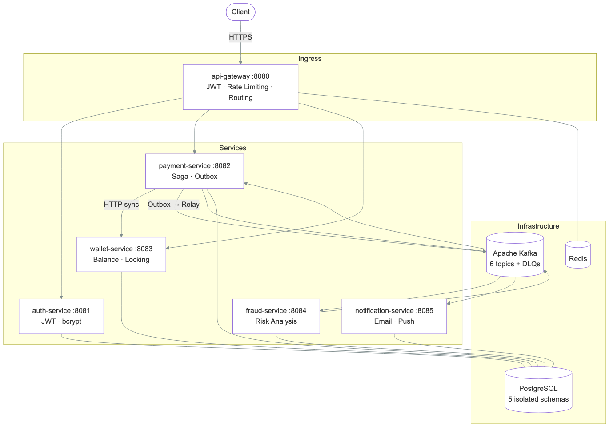
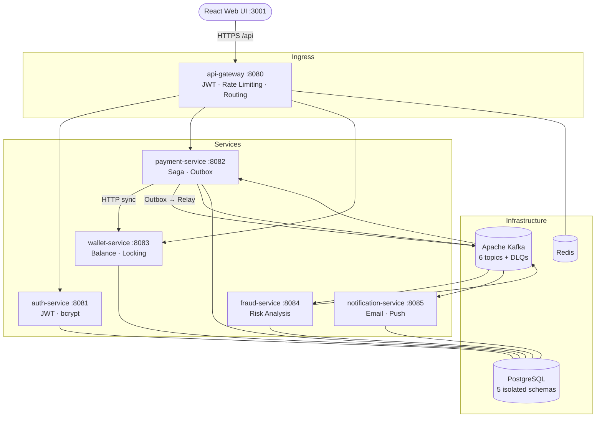
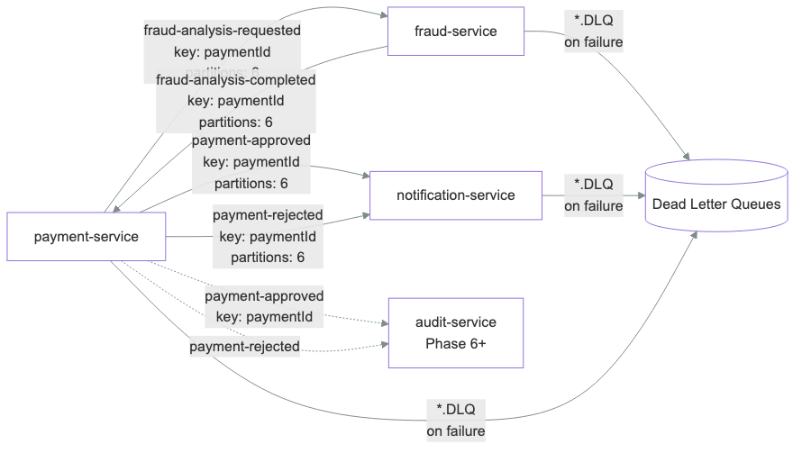
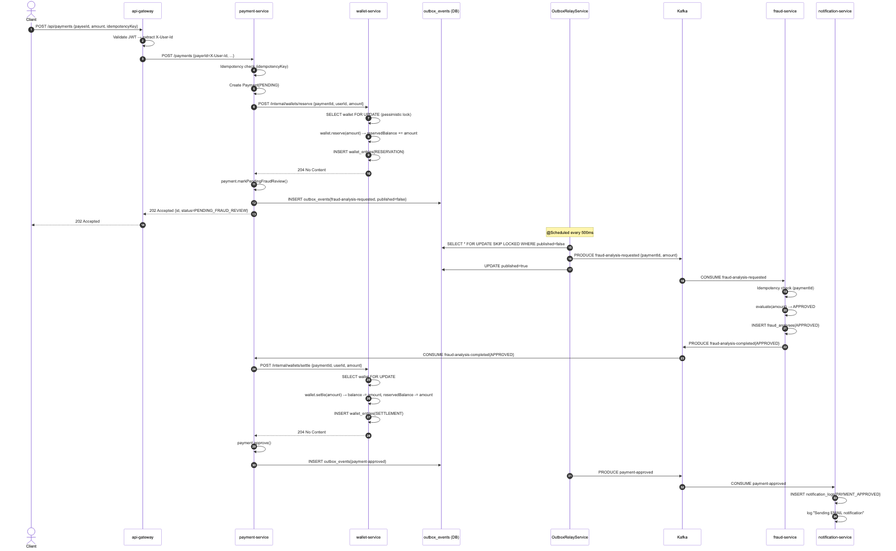

# FinFlow — Distributed Payment Platform (Full Stack)

A production-grade **full-stack** distributed payment platform simulating a real-world fintech product. Backend: Java 21, Spring Boot 3, Kafka, PostgreSQL, Redis. Frontend: React + Vite + TypeScript dashboard with live saga visualization.

> Portfolio project demonstrating senior engineering practices: distributed transactions, event-driven design, resiliency patterns, observability, and a polished operator UI you can demo live.

## Live demo (portfolio)

| Asset | Link |
|---|---|
| **Loom walkthrough** | _Add URL after recording — [Demo Video LINK]([docs/LOOM-SCRIPT.md](https://drive.google.com/file/d/1RxolJzuusXi7tnbZQdBLwqhUGS3w3_uN/view?usp=sharing))_ |
| **UI on Vercel (optional)** | _Frontend only — [Vercel LINK](https://finflow1-sigma.vercel.app/login) |
| **Run locally** | `cd infra/docker && docker compose up -d --build` → http://localhost:3001 |

> **Note:** The full stack (Kafka + microservices) is designed for Docker Compose demos. The React UI can be hosted on Vercel for free; API calls need a running local/cloud backend.

---

## Architecture





---

## Implemented Patterns

| Pattern | Where | Guarantee |
|---|---|---|
| **Choreography Saga** | payment → wallet → fraud → notification | Distributed transaction without 2PC |
| **Transactional Outbox** | payment-service | Atomic DB write + Kafka publish, no dual-write risk |
| **Pessimistic Locking** | wallet-service | `SELECT FOR UPDATE` prevents race conditions on balance |
| **Idempotency Keys** | payment-service (HTTP), wallet-service (reserve/settle/release) | Safe retries without double-charges |
| **Dead Letter Queue** | All Kafka consumers | Failed messages preserved for ops inspection |
| **ExponentialBackOff** | All Kafka consumers | 1s → 2s → 4s before DLQ |
| **JWT Authentication** | api-gateway (validation) + auth-service (issuance) | Stateless auth, 15m access / 7d refresh |
| **Rate Limiting** | api-gateway + Redis | Token bucket per client |
| **Circuit Breaker** | payment → wallet HTTP calls | Resilience4j (Phase 6+) |
| **Distributed Tracing** | All services | W3C trace context, Brave → Zipkin |
| **Structured Logging** | All services | JSON via logstash-logback-encoder, traceId in every line |

---

## Tech Stack

| Layer | Technology |
|---|---|
| Frontend | React 19, Vite, TypeScript, TanStack Query, React Router |
| Language | Java 21 |
| Framework | Spring Boot 3.4, Spring Cloud 2024 |
| Gateway | Spring Cloud Gateway (reactive) |
| Security | Spring Security 6, JJWT 0.12 |
| Messaging | Apache Kafka 7.7 |
| Database | PostgreSQL 16 |
| Cache | Redis 7 |
| Build | Gradle 8 (Kotlin DSL, version catalog) |
| Observability | Micrometer Tracing (Brave), Prometheus, Grafana, Zipkin |
| API Docs | SpringDoc OpenAPI 2.7 (Swagger UI) |
| Testing | JUnit 5, Mockito, Testcontainers |
| CI/CD | GitHub Actions |
| Infrastructure | Docker, Docker Compose |

---

## Services

| Service | Port | Swagger UI | Description |
|---|---|---|---|
| **web** | 3001 | — | React dashboard (auth, wallet, payments, saga timeline) |
| api-gateway | 8080 | — | Ingress: JWT validation, rate limiting, routing |
| auth-service | 8081 | `/swagger-ui.html` | User registration, login, JWT + refresh token lifecycle |
| payment-service | 8082 | `/swagger-ui.html` | Transaction creation and saga orchestration |
| wallet-service | 8083 | `/swagger-ui.html` | Balance reservation, settlement, pessimistic locking |
| fraud-service | 8084 | — | Asynchronous risk analysis via Kafka |
| notification-service | 8085 | — | Email/push notification delivery |

---

## Kafka Topics



| Topic | Partitions | Producer | Consumers |
|---|---|---|---|
| `fraud-analysis-requested` | 6 | payment-service | fraud-service |
| `fraud-analysis-completed` | 6 | fraud-service | payment-service |
| `payment-approved` | 6 | payment-service | notification-service |
| `payment-rejected` | 6 | payment-service | notification-service |
| `*.DLQ` | 1 | consumers (on failure) | ops alerting |

Partition key: `paymentId` — guarantees ordering for all events belonging to the same payment.

---

## Payment Flow



```
1.  POST /api/auth/login                 → access_token (JWT, 15m TTL)
2.  POST /api/payments  {idempotencyKey} → 202 PENDING_FRAUD_REVIEW
3.  wallet-service reserves balance      → SELECT FOR UPDATE SKIP LOCKED
4.  payment-service writes to outbox     → atomic with payment state change
5.  OutboxRelayService publishes         → fraud-analysis-requested (Kafka)
6.  fraud-service analyzes               → amount > 50,000 BRL → REJECTED
7.  payment-service receives result      → settle or release wallet balance
8.  payment-service writes approved/rejected to outbox
9.  notification-service consumes        → email simulation
```

---

## Quick Start (full stack)

### Prerequisites
- Docker 24+, Docker Compose v2

```bash
cd infra/docker
docker compose up -d --build
```

| Surface | URL |
|---|---|
| **Web UI** | http://localhost:3001 |
| API Gateway | http://localhost:8080 |
| Kafka UI | http://localhost:8090 |

Then open the UI → Register → Create wallet → Send a payment (use a second account’s user id as payee).

### Frontend-only local dev

```bash
cd web
npm install
npm run dev
```

Vite serves http://localhost:5173 and proxies `/api` → gateway `:8080`.

### Deploy / live demo + resume talking points

See [docs/DEPLOY.md](docs/DEPLOY.md). In the app, open **Resume story** for a 2-minute interview demo script.

**Resume one-liner:** Built FinFlow, a full-stack distributed payment platform (Spring microservices + React) with Kafka choreography saga, transactional outbox, wallet locking, and a live UI for async fraud decisions.

---

## Quick Start (infra + API)

### Prerequisites
- Docker 24+, Docker Compose v2

```bash
# Clone and start infrastructure + all services
cd infra/docker
docker compose up -d

# Start observability stack (Prometheus, Grafana, Zipkin)
docker compose -f docker-compose.monitoring.yml up -d
```

### Test the full flow

```bash
# 1. Register
curl -X POST http://localhost:8080/api/auth/register \
  -H "Content-Type: application/json" \
  -d '{"email":"user@example.com","password":"Password123!"}'

# 2. Login → get token
TOKEN=$(curl -s -X POST http://localhost:8080/api/auth/login \
  -H "Content-Type: application/json" \
  -d '{"email":"user@example.com","password":"Password123!"}' | jq -r .accessToken)

# 3. Create wallet
curl -X POST http://localhost:8080/api/wallets \
  -H "Authorization: Bearer $TOKEN" \
  -H "Content-Type: application/json" \
  -d '{"userId":"<your-uuid>","initialBalance":5000,"currency":"BRL"}'

# 4. Create payment (async — fraud analysis kicks in via Kafka)
curl -X POST http://localhost:8080/api/payments \
  -H "Authorization: Bearer $TOKEN" \
  -H "Content-Type: application/json" \
  -d '{"payeeId":"<payee-uuid>","amount":500,"currency":"BRL","idempotencyKey":"pay-001"}'

# 5. Poll until APPROVED
curl http://localhost:8080/api/payments/<payment-id> -H "Authorization: Bearer $TOKEN"
```

### Monitoring

| Tool | URL | Credentials |
|---|---|---|
| Grafana | http://localhost:3000 | admin / admin |
| Prometheus | http://localhost:9090 | — |
| Zipkin | http://localhost:9411 | — |
| Kafka UI | http://localhost:8090 | — |
| **Web UI** | http://localhost:3001 | — |
| Swagger (auth) | http://localhost:8081/swagger-ui.html | — |
| Swagger (payment) | http://localhost:8082/swagger-ui.html | — |
| Swagger (wallet) | http://localhost:8083/swagger-ui.html | — |

---

## Local Development (without Docker)

```bash
# Start infrastructure only
cd infra/docker
docker compose up -d postgres redis kafka zookeeper kafka-init

# Run any service
./gradlew :auth-service:bootRun
./gradlew :payment-service:bootRun
```

---

## Project Structure

```
distributed-payment-platform/
├── .github/workflows/ci.yml           # GitHub Actions — build + test on every push
├── web/                               # React + Vite dashboard (nginx in Docker)
├── api-gateway/                       # Spring Cloud Gateway, JWT filter, Redis rate limiting
├── auth-service/                      # JWT auth, refresh tokens, Swagger UI
├── payment-service/                   # Saga orchestrator, Transactional Outbox, Swagger UI
├── wallet-service/                    # Pessimistic locking, idempotent operations, Swagger UI
├── fraud-service/                     # Kafka-only, risk rules engine
├── notification-service/              # Kafka-only, email simulation
├── shared-libs/
│   ├── common-domain/                 # AggregateRoot, DomainEvent, base exceptions
│   └── common-events/                 # Kafka event records (shared between producers/consumers)
├── infra/
│   ├── docker/                        # docker-compose.yml, init-db.sql
│   └── monitoring/                    # Prometheus config, Grafana dashboards + provisioning
└── docs/
    ├── DEPLOY.md                      # Live demo / cloud deploy guide
    ├── adr/                           # ADR-001 through ADR-005
    └── diagrams/                      # System architecture, payment sequence, Kafka flow
```

---

## Diagrams

| Diagram | File |
|---|---|
| System Architecture | [docs/images/architecture.png](docs/images/architecture.png) |
| Payment Sequence (happy path) | [docs/images/payment-happy-path.png](docs/images/payment-happy-path.png) |
| Payment Rejection | [docs/images/payment-rejection.png](docs/images/payment-rejection.png) |
| Kafka Event Flow | [docs/images/kafka-topics.png](docs/images/kafka-topics.png) |

---

## Architecture Decisions

| # | Decision | Rationale |
|---|---|---|
| [ADR-001](docs/adr/ADR-001-microservices-architecture.md) | Microservices | Independent scaling, fault isolation, team autonomy |
| [ADR-002](docs/adr/ADR-002-kafka-event-driven-communication.md) | Kafka messaging | Durable, replayable, decoupled async communication |
| [ADR-003](docs/adr/ADR-003-saga-pattern.md) | Choreography Saga | No central orchestrator, services remain autonomous |
| [ADR-004](docs/adr/ADR-004-outbox-pattern.md) | Transactional Outbox | Atomic DB write + event publish, no dual-write risk |
| [ADR-005](docs/adr/ADR-005-observability-stack.md) | Micrometer + Zipkin + Grafana | Unified tracing/metrics with minimal config overhead |

---

## Trade-offs & Design Decisions

**At-least-once delivery:** Kafka guarantees at-least-once. Every consumer implements idempotency — fraud-service checks `findByPaymentId`, wallet-service checks `existsByPaymentIdAndType` before applying mutations.

**Eventual consistency:** Payment status is PENDING_FRAUD_REVIEW for ~1s after creation. The system is eventually consistent — GET /payments/{id} may return PENDING briefly before the fraud pipeline completes.

**Synchronous wallet calls:** wallet-service is called synchronously from payment-service for balance reservation. This keeps the "available balance" response instant and avoids the complexity of async balance queries. The trade-off is: if wallet-service is down, payments fail immediately rather than queuing.

**Single PostgreSQL instance, multiple schemas:** For a portfolio project, schema isolation (not DB isolation) is used. In production with higher scale, each service would have a dedicated PostgreSQL cluster with connection pooling (PgBouncer).

**Fraud threshold is static:** The fraud engine uses a fixed threshold (50,000 BRL). In production this would be a configurable rule engine or ML model — the interface (`FraudAnalysisService.evaluate()`) is designed for easy extension.

---

## Scalability Considerations

- **Horizontal scaling:** All services are stateless. Scale by increasing container replicas.
- **Kafka partitioning:** 6 partitions per high-volume topic supports 6 concurrent consumers per group. Increase partitions before scaling consumers past 6.
- **Outbox relay:** Multiple relay instances are safe due to `SELECT FOR UPDATE SKIP LOCKED` — each instance claims a disjoint batch.
- **Wallet locking:** Pessimistic write locks are held for the duration of the balance mutation (< 5ms). Under high concurrency, this serializes writes per wallet — acceptable for a single-user wallet model.

---

## Security Considerations

- JWT access tokens expire in 15 minutes; refresh tokens in 7 days
- Refresh tokens stored as SHA-256 hashes — raw tokens never persisted
- API Gateway strips all `X-User-*` inbound headers before routing — prevents header injection
- BCrypt cost factor 10 for password hashing
- Schema-level DB isolation prevents cross-service data access

---

## CI/CD

GitHub Actions runs on every push:
1. Sets up JDK 21 (Temurin) and Gradle 8.11.1
2. Runs all unit and integration tests (`gradle test`)
3. Builds all service JARs (`gradle bootJar`)
4. Uploads test reports as artifacts (14-day retention)

---

## Roadmap

- [x] Phase 1 — Infrastructure, API Gateway, Auth Service
- [x] Phase 2 — Payment Service, Wallet Service (synchronous flow)
- [x] Phase 3 — Kafka async pipeline: Fraud, Notification
- [x] Phase 4 — Transactional Outbox, Wallet Idempotency, ExponentialBackOff retry
- [x] Phase 5 — OpenTelemetry tracing, Micrometer custom metrics, Grafana dashboards
- [x] Phase 6 — GitHub Actions CI, OpenAPI/Swagger, Mermaid diagrams, graceful shutdown
- [x] Phase 7 — Audit Service (immutable log) + Kubernetes manifests (HPA, PDB, Ingress)
- [x] Phase 8 — React full-stack UI, payment list API, Dockerized web, deploy guide

---

## Status

✅ Full-stack ready for local demos. Production-style backend + React UI + Docker Compose bring-up. See [docs/DEPLOY.md](docs/DEPLOY.md) for hosting a live link.
