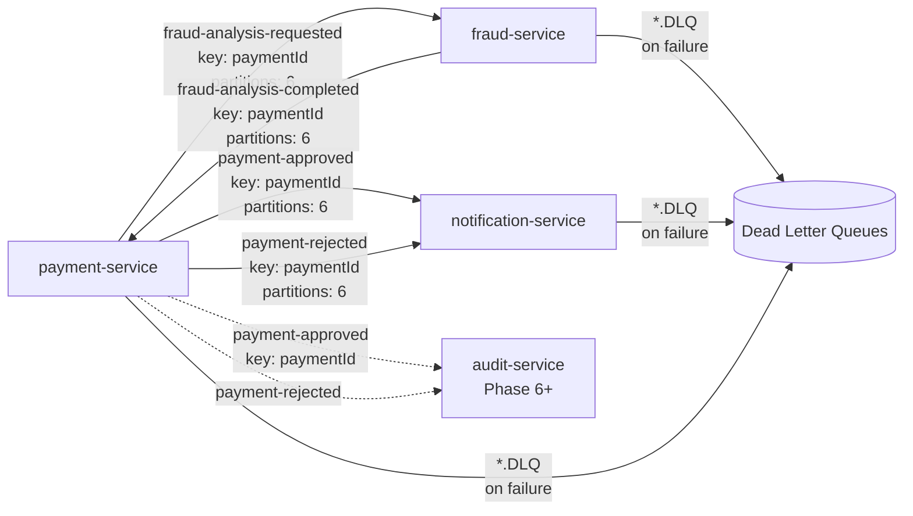

# Kafka Event Flow

## Topic Map



## Event Schemas

### fraud-analysis-requested
```json
{
  "eventId": "uuid",
  "occurredAt": "2025-05-11T14:30:00Z",
  "paymentId": "uuid",
  "payerId": "uuid",
  "amount": "1500.00",
  "currency": "BRL"
}
```

### fraud-analysis-completed
```json
{
  "eventId": "uuid",
  "occurredAt": "2025-05-11T14:30:01Z",
  "paymentId": "uuid",
  "decision": "APPROVED",
  "reason": "All checks passed"
}
```

### payment-approved
```json
{
  "eventId": "uuid",
  "occurredAt": "2025-05-11T14:30:02Z",
  "paymentId": "uuid",
  "payerId": "uuid"
}
```

### payment-rejected
```json
{
  "eventId": "uuid",
  "occurredAt": "2025-05-11T14:30:00Z",
  "paymentId": "uuid",
  "reason": "Insufficient funds"
}
```

## Retry & DLQ Strategy

| Consumer | Topic | Backoff | DLQ Topic |
|---|---|---|---|
| payment-service | fraud-analysis-completed | 1s → 2s → 4s | fraud-analysis-completed.DLQ |
| fraud-service | fraud-analysis-requested | 1s → 2s → 4s | fraud-analysis-requested.DLQ |
| notification-service | payment-approved | 1s → 2s → 4s | payment-approved.DLQ |
| notification-service | payment-rejected | 1s → 2s → 4s | payment-rejected.DLQ |

Max elapsed: 8s. After 3 retries, the original message is forwarded to the `.DLQ` topic with the original payload intact for ops inspection.

## Partition Strategy

All high-volume topics use `paymentId` as the partition key. This guarantees that all events for the same payment are processed in order within a single partition, which is required for the choreography saga to remain consistent.
