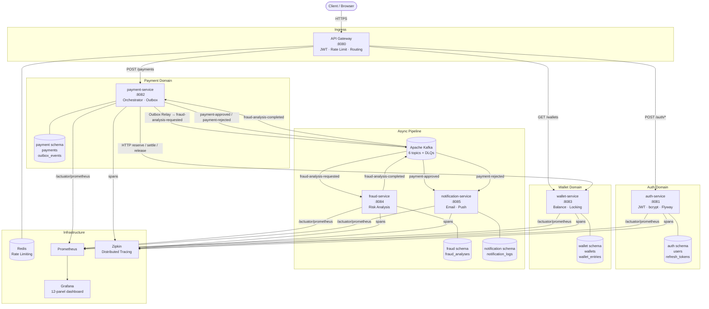

# System Architecture

## Service Topology

## Data Isolation

Each service owns exactly one PostgreSQL schema. Cross-schema queries are prohibited at the application level — each `application.yml` sets `hibernate.default_schema` and Flyway `schemas` to a single named schema.

## Communication Matrix

| From | To | Protocol | When |
|---|---|---|---|
| api-gateway | auth-service | HTTP (sync) | Authentication |
| api-gateway | payment-service | HTTP (sync) | Payment creation |
| api-gateway | wallet-service | HTTP (sync) | Balance queries |
| payment-service | wallet-service | HTTP (sync) | reserve · settle · release |
| payment-service | Kafka | async (outbox) | After wallet reservation |
| fraud-service | Kafka | async | Analysis result |
| notification-service | Kafka | async (consume) | Payment outcome |
